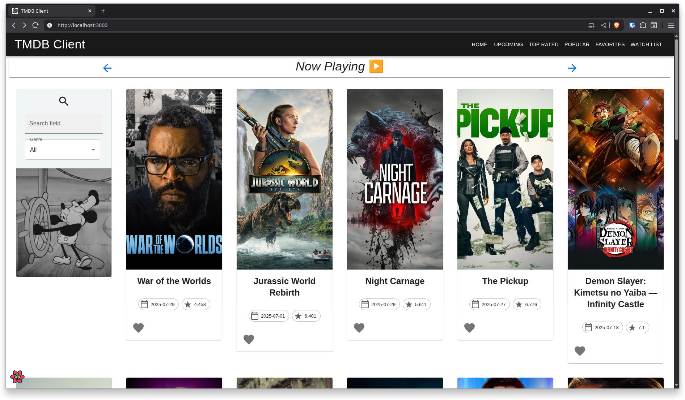

# TMDB Client 🎥
**`Web App Development 2: Assignment 1`**

**Robert Walsh**

---

### 💻 🔧 Languages and Tools

<p align="center">


</p>

---

### Description ✏️

A Web Application which pulls data using TMDB.

*Existing Features*
- You can browse *Upcoming Movies*, 
- Favourite Movies and add them to your *Favourites*
- See Movie Details such as a *Description*, *Genres*, *Runtime*, *Production Countries*
- View and write your own *Reviews*

*New Features*
- View *Now Playing*, *Top Rated Movies* and *Popular Movies*.
- See the *Cast List* within Movie Details.
- See which *Providers* are hosting the movie to Stream, Buy or Rent in Ireland.
- Added *Pagination* so multiple pages of results can be viewed for each category

---

### API Endpoints 📍
- Now Playing - `movie/now_playing`
- Upcoming - `movie/upcoming`
- Top Rated - `movie/top_rated`
- Popular - `movie/popular`
- Reviews - `movie/id/reviews`
- Movie Genres - `genre/movie`
- Movie Images - `movie/id/images`
- Watch Providers - `movie/id/watch/providers`
- Movie Cast - `movie/id/credits`


### Getting Started (Written for Linux/MacOS) ✨

1. Create a folder
```
mkdir tmdb_client
```

2. Clone Repo and go the app folder

```
git clone https://github.com/robert-walshh/tmdb-client-v1
cd movies
```

3. Create .env File and fill in the following info...
```
REACT_APP_TMDB_KEY=<YOUR-API-KEY>
FAST_REFRESH=false
```

4. Install Node.js (See your OS Installation Instructions) and App Dependencies
```
npm --version
npm install
```

5. Start Development Server
```
npm start
```

---

<p align="center">
    
</p>

